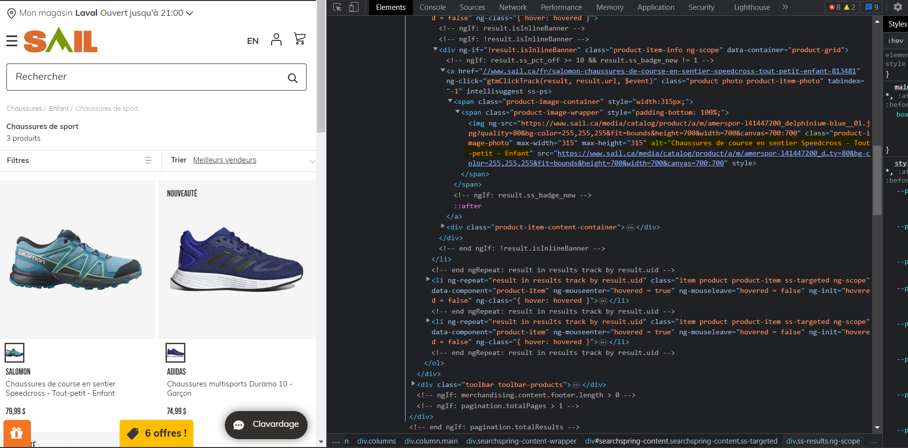
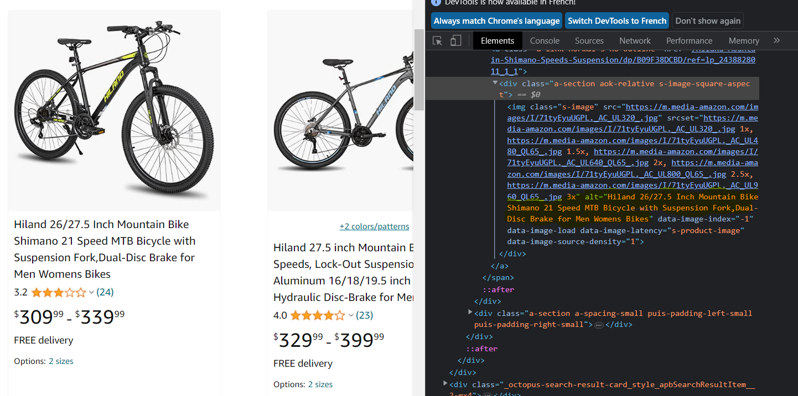
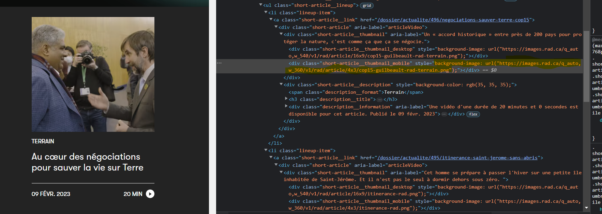
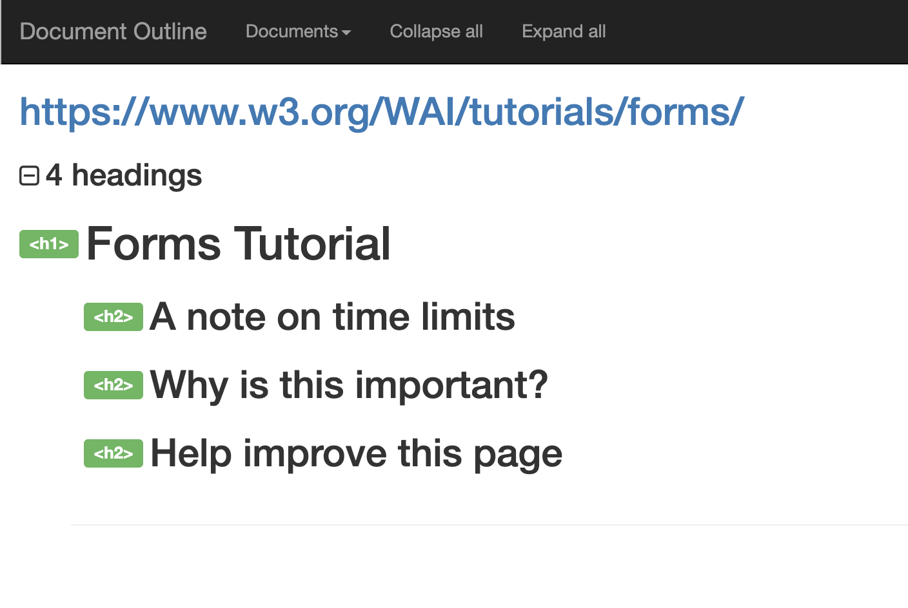
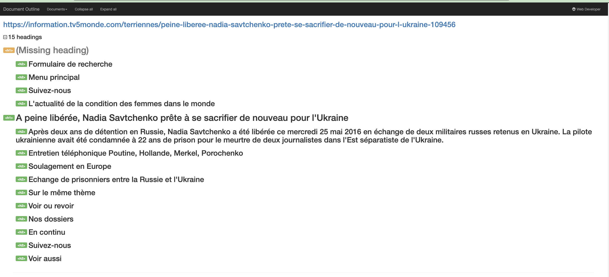

# Exercice d'accessibilité des contenus

## Équipe
- Lorie-Anne Côté
- Kate Undercoffler

## Objectifs
- Expérimenter le versionnage de fichiers avec GIT 
- Acquérire des compétences en accessibilité des contenus 

## Prérequis
- Avoir lu et pris connaissance des notes du cours 10 
- Avoir un compte GitHub 
- Avoir installé et configurer GIT sur votre ordinateur 
- Avoir installé l'outil CCA (colour-contrast-analyzer) 

## Instructions

### 0. 
- [x] Initialiser un dépôt GIT dans le dossier du projet
- [x] Créer un fichier `index.html` et un fichier `style.css`

### 1.	Donner une alternative textuelle aux images

#### 1.1 Baliser dans le fichier `index.html` les images du dossier `1-textes-alternatifs` 

- [x] Pour vous guider dans le choix des balises, des attributs et des valeurs d'attributs, utiliser l'arbre de décision et référez-vous aux notes de cours.

#### 1.2 Évaluer la pertinence des contenus textuels alternatifs

- [x] Pour chacune des pages ci-dessous, les textes alternatifs sont-ils adéquats ?Commenter votre observation. Pourrait-on faire mieux ? Donnez un exemple de ce que vous proposeriez.

---

- https://www.sail.ca/fr/chaussures/junior/multi-sport-et-plein-air 

Le texte alternatif est bien dans l'ensemble. On a accès à la marque de la chaussure, sa taille (tout-petit) et le type de chaussure, mais il manque la couleur. Atl utilisé parce que l'image est placé dans un hyperlien, on veut être sûr que l'image est associé au produit.

---
- https://amzn.to/2NnbKPN 

Le texte alternatif est assez lourd et il manque, encore une fois, la couleur de l'article. Les éléments important sont là.

---
- https://www.lesoleil.com/  

Les textes atl répètent simplement le titre des articles, ils ne décrivent pas l'image en soi. Il faudrait qu'il décrive l'image, par exemple: 
> alt="Une voiture de police est stationner devant l'école ou s'est passé le drame"

---
- https://www.rad.ca/  

La plupart des images ne contiennent pas de texte alternatif, ce sont des images utilisées sur la feuille de style CSS avec "background-image". Il serait peut-être mieux d'ajouter des images sur le html au lieu du CSS avec les balises **img** et **alt** dans une balise d'hyperlien pour une meilleure accessibilité.

---

Astuce  
Parfois, l’affichage des alt ne donnent pas un résultat facile à lire… lorsque cela se produit, faites un clic droit de la souris et choisir inspecter pour positionner l’inspecteur de DOM sur le HTML de l’image.
Essayer d’identifier l’emplacement du alt et puis regarder s’il y a une description tout de suite après.

### 2.Vérifier les contrastes de couleurs

#### 2.1	Utiliser l’outil d’analyse de contraste des couleurs (CCA) pour identifier les problèmes de contrastes sur cette page : http://2016.webaquebec.org/

Pour chaque problème de contraste identifié,
documenter le problème par une capture-écran incluant dans son cadre, la zone fautive à gauche et à droite, les résultats détaillés de l’outil, tel que démontré dans l’exemple ci-dessous.

Sauvegarder les captures dans le dossier images. Compléter les liens ci-dessous:

---

---

### 3. Structurer avec les h1-h6 une table des matières

#### 3.1 Vérifier la structure

D’après les captures-écrans que vous trouverez dans le dossier [images/3-table-des-matieres_h1-h6/3-1/](images/3-table-des-matieres_h1-h6/3-1) , est-ce que la table des matières du document est correcte?  

Sinon, expliquez le problème en vous basant sur les règles de base énoncées dans les notes de cours. 

__Tutoriel sur les formulaires du w3c__  

[Article](images/3-table-des-matieres_h1-h6/3-1/tuto-form-w3c.pdf)  

 

Réponse : 

La table des matières du document est très bien construite. On voit bien le titre principal **(h1)** de la page "Forms Tutorial" ainsi que ses sous-titres **(h2)**.

__L’affaire Savtchenko__ 

[Article](images/3-table-des-matieres_h1-h6/3-1/article-savtchenko.pdf)  

 
  
Réponse : 

L'utilisation des titres et des sous-titres est mauvaise. Plusieurs éléments sont mis en h2 alors que ce ne devrait pas être le cas. La navigation principale, le formulaire de recherche et les médias ne devraient pas être mis dans des balises titre et/ou sous-titre, ils devraient même avoir leur propre balise (nav, ul/li, small, div). Bref, ce ne sont pas des éléments titres. Cependant, je crois que le H1 est correctement utilisé, contrairement aux h2.

#### 3.2 S'exercer à bien structurer

- Ouvrir la capture-écran [concevoir-un-design-sans-la-couleur](images/3-table-des-matieres_h1-h6/3-2/concevoir-un-design-sans-la-couleur.pdf) que vous trouverez dans le dossier `sources > h1h6-partie-2` dans le logiciel PhotoShop.  
- Ajouter un calque de blanc à 50% de transparence
- Dans un 3e calque, par-dessus, identifiez les titres et leurs niveaux (h1-h6) de manière voyante (couleur rouge et font-size suffisant)
- Sauvegarder au format .psd ou .png dans le même dossier.

Facultatif: h4 (les sous-titres/liens), sous les h3, qui sont en bleu.

### 4. Baliser un tableau de données pour qu’il soit accessible

D’après la capture-écran et le texte fourni dans le dossier [4-tableau-de-donnees](images/4-tableau-de-donnees), balisez de manière accessible ce tableau de données.  
  
Votre tableau de données doit comporter un titre (caption) : 

> "Recommandations de consommation de poissons selon l’âge, le sexe et la condition physique".  

Les __entêtes de rangées et de colonnes__ doivent être balisées comme des `<th>` plutôt que des `<td>` et puisque le tableau est *complexe*, vous devez utiliser des attributs `id` dans les `<th>`. 

Chaque cellule `<td>` du tableau doit avoir un attribut headers avec comme valeur(s), le ou les identifiants de ses entêtes de colonnes et de rangées.

Styler le tableau conformément au fichier [consommation-poissons.pdf](images/4-tableau-de-donnees/consommation-poissons.pdf).

#### Ressources
•	balisage accessible d’un tableau (voir les notes du cours 10)
•	balisage html : https://www.w3schools.com/TAGs/tag_table.asp
•	balisage css de tableau: https://www.w3schools.com/css/css_table.asp

